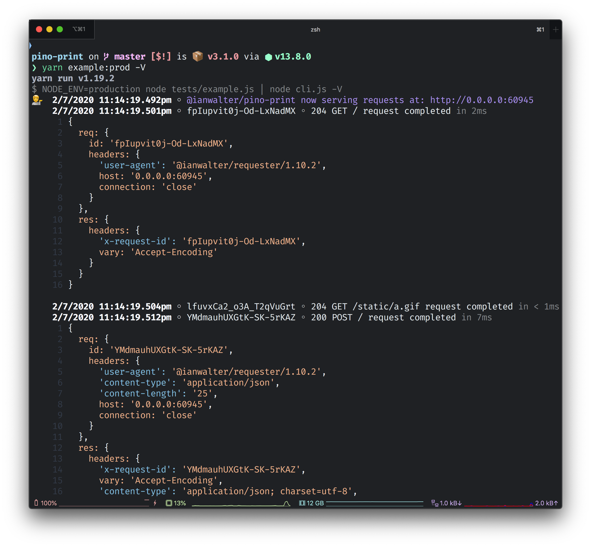

# @ianwalter/pino-print
> Makes Pino log lines easy to read

[![npm page][npmImage]][npmUrl]
[![CI][ciImage]][ciUrl]



## Installation

```console
yarn add @ianwalter/pino-print
```

## CLI Usage

```console
node server.js | pino-print
```

## Options

* `--level, -l <debug|info>`

## License

Apache 2.0 with Commons Clause - See [LICENSE][licenseUrl]

&nbsp;

Created by [Ian Walter](https://iankwalter.com)

[npmImage]: https://img.shields.io/npm/v/@ianwalter/pino-print.svg
[npmUrl]: https://www.npmjs.com/package/@ianwalter/pino-print
[ciImage]: https://github.com/ianwalter/pino-print/workflows/CI/badge.svg
[ciUrl]: https://github.com/ianwalter/pino-print/actions
[licenseUrl]: https://github.com/ianwalter/pino-print/blob/master/LICENSE

