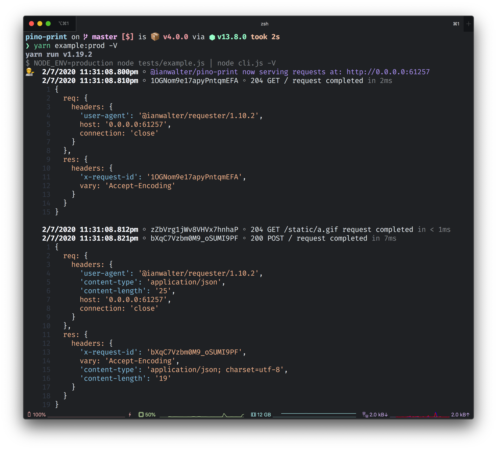

# @ianwalter/pino-print
> Makes Pino log lines easy to read

[![npm page][npmImage]][npmUrl]
[![CI][ciImage]][ciUrl]



## Installation

```console
yarn add @ianwalter/pino-print
```

## CLI Usage

```console
node server.js | npx pino-print
```

## Options

* `--verbose, -v` Output more request/response information (default: false)
* `--static, -s <path>` Specify a path that matches requests for static files so
  less information is logged for those requests/responses when in verbose mode
  (default: /static)
* `--(no-)ansi, -a` Enables (default) or disables ANSI escape sequences used to
  format output (via Chalk)

## License

Hippocratic License - See [LICENSE][licenseUrl]

&nbsp;

Created by [Ian Walter](https://ianwalter.dev)

[npmImage]: https://img.shields.io/npm/v/@ianwalter/pino-print.svg
[npmUrl]: https://www.npmjs.com/package/@ianwalter/pino-print
[ciImage]: https://github.com/ianwalter/pino-print/workflows/CI/badge.svg
[ciUrl]: https://github.com/ianwalter/pino-print/actions
[licenseUrl]: https://github.com/ianwalter/pino-print/blob/master/LICENSE

